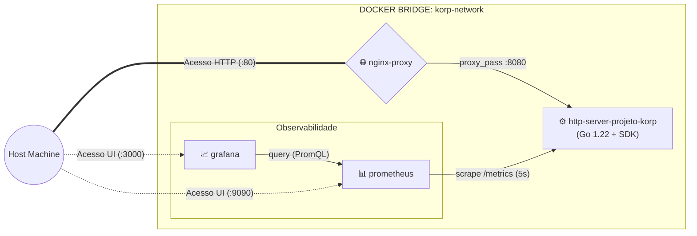

# Desafio DevOps - Projeto Korp

Solução completa de engenharia de infraestrutura, observabilidade e automação para o desafio técnico da Korp. O projeto implementa uma arquitetura de microsserviços conteinerizada, telemetria declarativa (Golden Signals), alertas ativos, governança de recursos (CPU/RAM), conformidade com os princípios do Twelve-Factor App e provisionamento idempotente via Ansible encapsulado.

---

## 🏛️ Visão Geral da Arquitetura



---

## Componentes e Decisões Técnicas de Design

### API Go (`http-server-projeto-korp`)

- **Multi-stage Build:** Compilação em `golang:1.22-alpine` gerando um binário estático puro (`CGO_ENABLED=0`, `-ldflags="-w -s"`), empacotado sobre imagem enxuta `alpine:3.19` (~15MB total).
- **Segurança e Higiene:** Execução sob usuário sem privilégios (`appuser`, UID 1000) e isolamento do contexto de compilação via `.dockerignore`.
- **Telemetria Nativa:** Integração com SDK oficial `client_golang` expondo `http_server_up` (Gauge), `http_requests_total` (Counter com labels `path` e `status`) e métricas de runtime do Go (Heap alocada, Goroutines e GC).
- **Timeouts Defensivos:** Proteção contra ataques de exaustão de conexões (Slowloris) com `ReadHeaderTimeout`, `ReadTimeout` e `WriteTimeout` explicitamente configurados.

### Reverse Proxy & Hardening de Borda (nginx)

- Ponto único de entrada na porta 80, mantendo a porta interna da API Go (8080) protegida na rede Docker interna.
- **OWASP Security Headers:** Inclusão de `X-Frame-Options: DENY`, `X-Content-Type-Options: nosniff`, `X-XSS-Protection: 1; mode=block` e `Referrer-Policy: strict-origin-when-cross-origin`.
- Restrição estrita de métodos HTTP (apenas requisições `GET` são aceitas na rota `/projeto-korp`).

### Monitoramento & Alertas Ativos (prometheus)

- Intervalo de raspagem (scrape interval) em 5s e retenção de séries temporais em 7 dias (`--storage.tsdb.retention.time=7d`).
- **Alerting Rules Declarativas** (`alerts.yml`):
  - `ServiceDown`: Dispara se a API Korp ficar indisponível por mais de 15 segundos.
  - `HighErrorRate`: Dispara caso a taxa de respostas com código 4xx ou 5xx ultrapasse 5% em uma janela de 1 minuto.

### Visualização Declarativa (grafana)

- **Provisioning as Code (IaC):** Datasource Prometheus e Dashboard SRE configurados automaticamente no boot via YAML/JSON, dispensando intervenção manual via interface.
- Painéis cobrindo os Golden Signals do Google SRE (Disponibilidade, Throughput atual, Volume cumulativo e Taxa de Erro) e métricas internas do runtime do Go (Consumo de memória Heap e Goroutines ativas).

### Governança de Recursos e Resiliência

- **Resource Limits (CPU & RAM):** Cotas e reservas definidas via `deploy.resources` no Docker Compose para prevenir exaustão de recursos no host hospedeiro.
- **Healthchecks Determinísticos:** O proxy reverso e o coletor aguardam o status de vivacidade (`service_healthy`) da API Go para inicializar.
- **Log Rotation:** Driver de logs `json-file` com teto de 10MB por arquivo (máximo de 3 arquivos por container).
- **Gestão de Segredos (Twelve-Factor App):** Desacoplamento de senhas e usuários administrativos via variáveis de ambiente com fallback padrão seguro (`${GRAFANA_ADMIN_PASSWORD:-admin}`) e `.env.example`.

---

## 🤖 Automação com Ansible (Control Node Containerizado)

Para garantir reprodutibilidade idêntica (Zero Drift) sem exigir dependências locais no host do avaliador, a automação com Ansible roda em um Runner Containerizado (`ansible/Dockerfile`):

- **Imagem Base:** Alpine Linux 3.20 com `ansible-core` 2.16, biblioteca `docker` 7.1.0 e coleção `community.docker` 3.10.0 fixadas.
- **Socket Binding:** Comunicação direta com o daemon através da montagem de `/var/run/docker.sock`.
- **Playbook Idempotente** (`ansible/playbooks/deploy.yml`):
  - Validação de conectividade com a Docker Engine.
  - Verificação prévia de integridade de todos os manifestos de configuração.
  - Build e subida da stack completa via `community.docker.docker_compose_v2`.
  - Teste de fumaça (healthcheck) com política de retry contra a borda do Nginx.
  - Disparo do gerador de telemetria e carga sintética.

---

## 🔄 Pipeline de CI/CD (GitHub Actions)

A esteira contínua (`.github/workflows/ci.yml`) é acionada a cada push ou pull request na branch `main`, dividida em dois estágios independentes:

**Code Quality & Linting:**
- Análise estática do Go via `go vet ./...`.
- Verificação de formatação de código idiomático via `gofmt`.
- Validação sintática do manifesto de infraestrutura com `docker compose config --quiet`.

**Integration & Smoke Tests:**
- Build das imagens imutáveis via Docker Buildx.
- Inicialização da stack completa e verificação dos healthchecks.
- Execução do script de carga sintética e inspeção dos logs dos serviços.

---

## 🚀 Como Executar o Projeto

### Pré-requisitos

Docker e Docker Compose instalados e em execução.

### Opção 1: Execução Universal via Makefile (Recomendado)

```bash
make up        # Constrói e inicializa a stack completa em segundo plano
make test      # Executa teste de fumaça e carga sintética
make ps        # Exibe o status e healthcheck dos containers
make logs      # Acompanha os logs em tempo real
make down      # Encerra e remove o ambiente
```

### Opção 2: Provisionamento Automatizado via Ansible (Windows PowerShell)

```powershell
.\run-ansible.ps1
```

### Opção 3: Execução Manual do Container Ansible

```bash
docker build -t korp-ansible-runner ./ansible
docker run --rm -it -v /var/run/docker.sock:/var/run/docker.sock -v "${PWD}:/workspace" korp-ansible-runner playbooks/deploy.yml
```

### Opção 4: Execução Direta via Docker Compose

```bash
docker compose up -d --build
```

---

## ⚙️ Variáveis de Ambiente

O projeto suporta customização das credenciais do Grafana via arquivo `.env`. Para alterar os padrões:

```bash
cp .env.example .env
```

| Variável | Padrão | Descrição |
|---|---|---|
| `GRAFANA_ADMIN_USER` | `admin` | Usuário administrador do painel Grafana |
| `GRAFANA_ADMIN_PASSWORD` | `admin` | Senha de acesso administrativo do Grafana |

---

## 🔗 Endpoints e Acessos

| Serviço | URL | Descrição / Credenciais |
|---|---|---|
| API Go (via Nginx) | http://localhost/projeto-korp | Endpoint principal de negócio |
| Métricas Raw | http://localhost/metrics | Endpoint de telemetria Prometheus exposto pela aplicação |
| Prometheus Web UI | http://localhost:9090 | Painel de controle e consultas PromQL |
| Prometheus Targets | http://localhost:9090/targets | Status de coleta da aplicação (UP) |
| Prometheus Alertas | http://localhost:9090/alerts | Regras de monitoramento ativas (ServiceDown, HighErrorRate) |
| Grafana Dashboard | http://localhost:3000 | Painel SRE pré-provisionado (User: `admin` / Pass: `admin`) |

---

## 🧪 Teste de Carga e Validação

Para testar o endpoint manualmente e acompanhar a variação das métricas em tempo real no Grafana e nos alertas do Prometheus:

```powershell
# Requisição direta via Nginx
curl.exe -i http://localhost/projeto-korp

# Disparo da bateria de carga sintética
python scripts/load-generator.py
```
