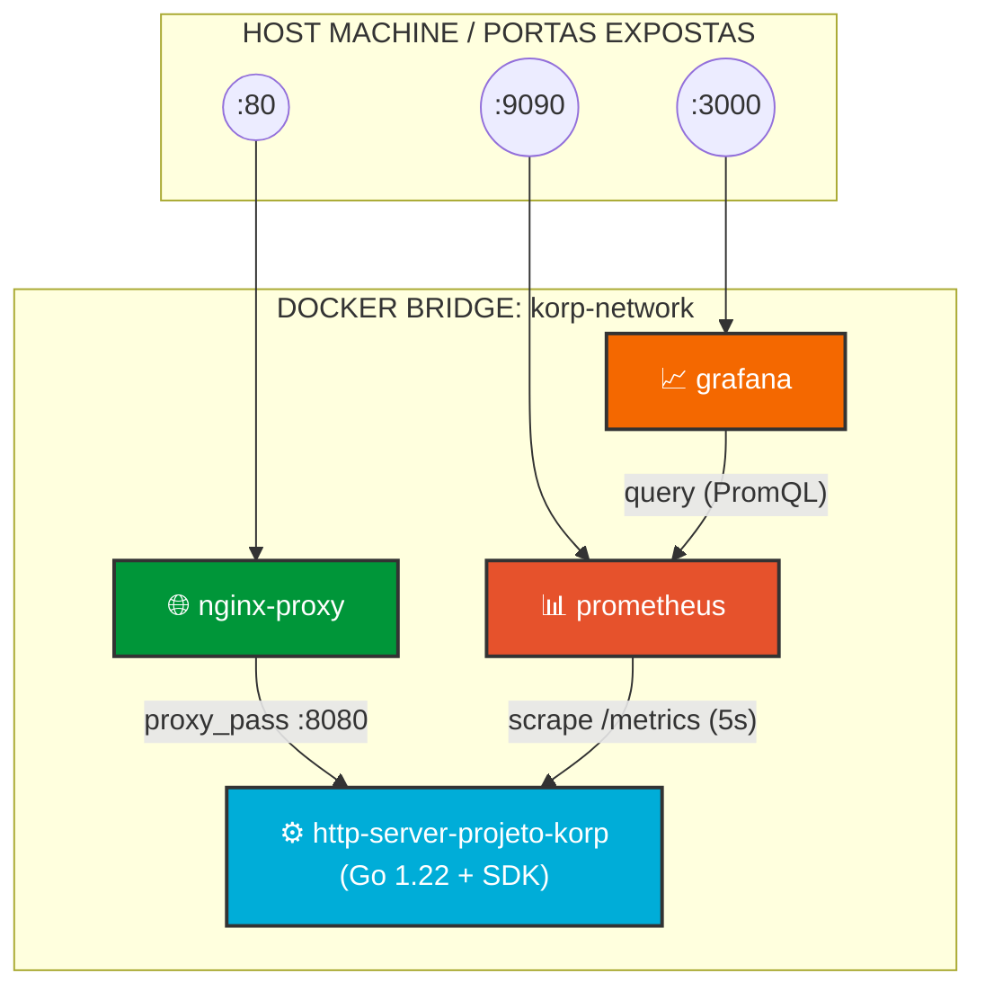

# Desafio DevOps - Projeto Korp

Solução completa de engenharia de infraestrutura, observabilidade e automação para o desafio técnico da Korp. O projeto implementa uma arquitetura de microsserviços com redes isoladas, telemetria declarativa (Golden Signals) e provisionamento idempotente via Ansible encapsulado.

---

## 🏛️ Visão Geral da Arquitetura

A solução é composta por 4 componentes conteinerizados sob uma rede bridge dedicada (`korp-network`), operando sob o princípio do menor privilégio e isolamento de borda:



### Componentes e Decisões de Design

1. **API Go (`http-server-projeto-korp`):**
   * **Multi-stage Build:** Compilação em `golang:1.22-alpine` gerando um binário estático puro (`CGO_ENABLED=0`, `-ldflags="-w -s"`), empacotado sobre imagem enxuta `alpine:3.19` (~15MB total).
   * **Segurança:** Execução sob usuário sem privilégios (`appuser`, UID 1000).
   * **Telemetria Nativa:** Integração com o SDK oficial `client_golang` expondo as métricas exigidas:
     * `http_server_up` (Gauge): Indicador de disponibilidade do serviço.
     * `http_requests_total` (Counter com labels `path` e `status`): Volume cumulativo de requisições.
     * Métricas de runtime do Go (heap alocada, goroutines ativas, uso de CPU e atividade do Garbage Collector).
   * **Timeouts Defensivos:** `ReadHeaderTimeout`, `ReadTimeout` e `WriteTimeout` explicitamente configurados contra ataques de exaustão de conexões (Slowloris).

2. **Reverse Proxy (`nginx`):**
   * Ponto de terminação e exposição pública na porta `80`.
   * Bloqueio de métodos HTTP não autorizados (somente `GET` permitido em `/projeto-korp`).
   * Headers de encaminhamento transparentes (`X-Real-IP`, `X-Forwarded-For`, `X-Forwarded-Proto`).
   * Desativação de buffers para métricas em tempo real (`proxy_buffering off`).
   * Configuração do proxy montada via volume em `/etc/nginx/conf.d/`, conforme requisito do desafio.

3. **Monitoramento & Métricas (`prometheus`):**
   * Coletor com *scrape interval* configurado em 5s direcionado ao endpoint interno `/metrics`.
   * Retenção de TSDB ajustada para 7 dias (`--storage.tsdb.retention.time=7d`).

4. **Visualização Declarativa (`grafana`):**
   * **Provisioning as Code (IaC):** datasource do Prometheus e dashboard SRE provisionados automaticamente na inicialização via arquivos YAML/JSON, sem necessidade de configuração manual via interface.
   * Painéis customizados cobrindo:
     * **Golden Signals:** service status (gauge), total de requisições (counter), throughput atual em req/s (`rate()`) e taxa de erro HTTP 4xx/5xx.
     * **Tráfego HTTP:** séries temporais de RPS segregadas por rota e código de status, além de gráfico de distribuição.
     * **Runtime do Go:** monitoramento de goroutines ativas e alocação de memória heap (`HeapAlloc` vs `HeapSys`).

5. **Configuração como Código:**
   * As configurações do Prometheus e do Grafana (`prometheus.yml`, `datasources.yml`, `dashboards.yml`) são incorporadas diretamente às imagens de cada serviço, garantindo builds reprodutíveis.
   * A configuração do NGINX é montada via volume em `/etc/nginx/conf.d/`, atendendo ao requisito explícito do desafio.

---

## 🛡️ Resiliência e Operabilidade em Produção

* **Healthchecks Nativos & Orquestração Determinística:** a API Go implementa healthcheck interno via `wget`. Os serviços dependentes (`nginx` e `prometheus`) utilizam `condition: service_healthy` no Docker Compose, prevenindo falhas de conexão (*502 Bad Gateway*) durante o boot da stack.
* **Política de Retenção de Logs:** driver de log `json-file` com limites estritos (`max-size: 10m`, `max-file: 3`) em todos os containers, para impedir a saturação do disco por logs descontrolados.
* **Simulação de Carga Automatizada (`scripts/load-generator.py`):** script que injeta requisições de sucesso e cenários de erro (HTTP 404), permitindo observar a variação das métricas e gráficos no Grafana.

---

## 🤖 Automação com Ansible (Control Node Containerizado)

Para garantir reprodutibilidade estrita, sem exigir dependências locais no host do avaliador, a automação com Ansible opera via **runner containerizado** (`ansible/Dockerfile`):

* **Imagem Base:** Alpine Linux 3.20 com `ansible-core` 2.16, biblioteca Python `docker` (v7.1.0) e a coleção oficial `community.docker` (v3.10.0), com versões travadas.
* **Socket Binding:** comunicação direta com o daemon do Docker através da montagem de `/var/run/docker.sock`.
* **Playbook Idempotente (`ansible/playbooks/deploy.yml`):**
  1. Validação de conectividade com o Docker Daemon.
  2. Verificação da presença de todos os arquivos de configuração necessários.
  3. Build e subida da stack completa via `community.docker.docker_compose_v2`.
  4. Requisição HTTP de validação contra a borda do NGINX, com política de retry.
  5. Exibição da resposta da requisição no console (`debug`), conforme requisito do desafio.
  6. Disparo do gerador de carga sintética.

---

## 🔄 Esteira de Integração Contínua (CI/CD Pipeline) — opcional

O repositório possui integração contínua via **GitHub Actions** (`.github/workflows/ci.yml`), disparada a cada push ou pull request na branch `main`:

* Setup do ambiente com Docker Buildx.
* Compilação das imagens e inicialização da stack completa via Docker Compose.
* Validação de integridade dos containers e execução do teste de carga simulado.
* Coleta de logs e status da infraestrutura para inspeção.

---

## 🚀 Como Executar o Projeto

### Pré-requisitos
* Docker e Docker Compose instalados e em execução.

### Método 1: Provisionamento Automatizado via Ansible (recomendado)

```bash
# Linux / macOS:
docker build -t korp-ansible-runner ./ansible
docker run --rm -it \
  -v /var/run/docker.sock:/var/run/docker.sock \
  -v "$(pwd):/workspace" \
  korp-ansible-runner playbooks/deploy.yml
```

```powershell
# Windows (PowerShell):
.\run-ansible.ps1

# ou manualmente:
docker build -t korp-ansible-runner ./ansible
docker run --rm -it -v //var/run/docker.sock:/var/run/docker.sock -v "${PWD}:/workspace" korp-ansible-runner playbooks/deploy.yml
```

### Método 2: Execução Direta via Docker Compose

```bash
docker compose up -d --build
```

### 🧪 Verificação Manual e Teste de Carga

Para testar o endpoint manualmente e acompanhar a variação em tempo real no Grafana:

```bash
# Requisição de sucesso (HTTP 200)
curl -i http://localhost/projeto-korp

# Disparar teste de carga sintético
python3 scripts/load-generator.py
```
